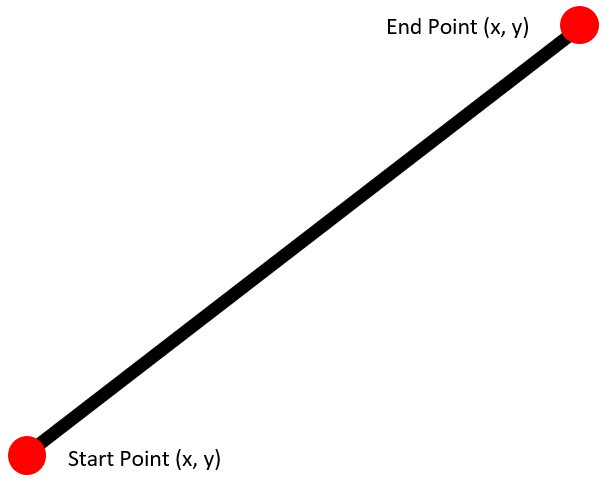
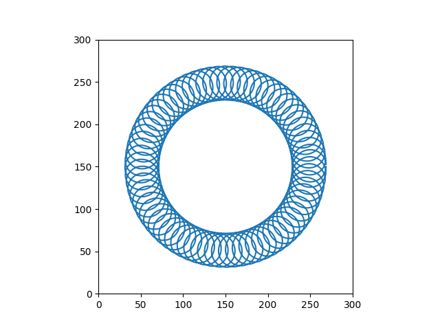
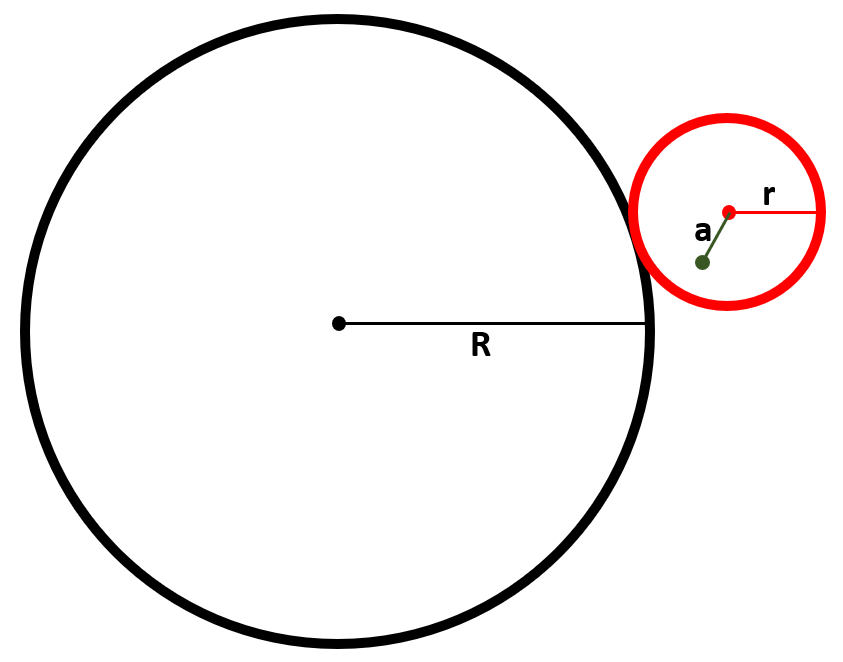
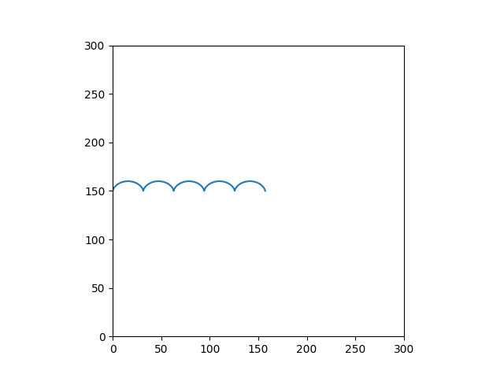
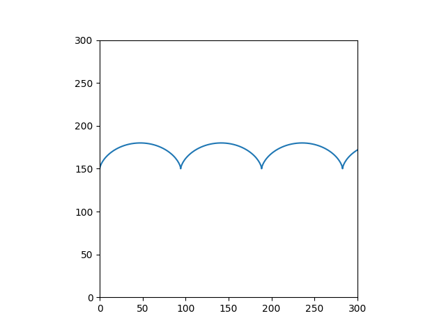
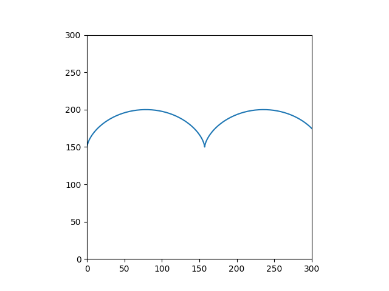

# Pen Plotting G-code Generator

This code is designed to generated gcode of gemetrical shapes to be used with pen plotting robots

# Shapes

## Line

`line(start_point, end_point, x_coords, y_coords)`

## Hypocycloid

### Explaination:

### Examples:
`R=50, r=1.32, a=100`

`R=50, r=1.32, a=50`

`R=100, r=1.32, a=20`

`hypocycloid(R, r, a ,theta ,resolution, x_coords, y_coords, x_shift=0, y_shift=0, send_to_plot=True, send_to_gcode=True)`

## Epicycloid

### Explaination:

### Examples:
`R=150, r=20, a=20`

`R=150, r=10, a=10`

`R=25, r=50, a=50`

`epicycloid(a, r, R, theta, resolution, x_coords, y_coords, x_shift=0, y_shift=0, send_to_plot=True, send_to_gcode=True)`

## Cycloid

### Explaination:

### Examples:
`R=5`

`R=15`

`R=25`
